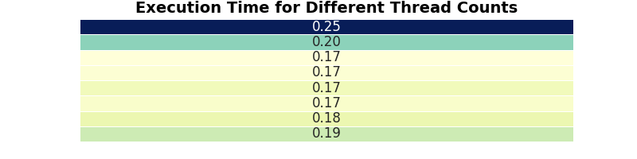

# Multi-Threading Analysis

This project is designed to analyze the performance of matrix multiplication with varying thread counts, based on the given assignment. The assignment involves multiplying 500 random matrices of size 5000 x 5000 with a constant matrix of the same size, tracking execution time across multiple threads, and visualizing CPU usage.

**Note**: Due to technical constraints, testing was conducted on smaller matrices. The provided results reflect this modified setup.

## Assignment Details

- **Objective**: Multiply 500 matrices of size 5000 x 5000 with a constant matrix of the same size.
- **Thread Count**: Tested from 1 to 8 threads.
- **Results**: Execution time for each thread count and a corresponding graph of CPU usage per core.

### Requirements

To install the required dependencies, run:

```bash
pip install -r requirements.txt
```

### requirements.txt

- `numpy`
- `pandas`
- `matplotlib`
- `seaborn`
- `psutil`

## Approach

1. **Matrix Multiplication**:
   - Each matrix is multiplied with a constant matrix in parallel using `multiprocessing.Pool`.
   - Execution time is measured for different thread counts (1-8 threads).

2. **CPU Usage Monitoring**:
   - CPU usage is recorded during matrix multiplications to observe performance differences as the thread count increases.
   - CPU usage per core is logged in real-time and visualized.

3. **Visualizations**:
   - **Execution Time Graph**: A line plot shows execution time versus thread count.
   - **CPU Usage Graph**: A line plot of average CPU usage over time for each thread configuration.
   - **Result Table**: A table displaying execution time in minutes for each thread count.

## Usage

To run the code, execute:

```bash
python main.py
```

This will perform matrix multiplication for each thread count (1-8) and display both execution time and CPU usage plots.

## Results

**Note**: The results provided below are based on a smaller matrix size for testing due to technical limitations.

### Execution Time Table

| Threads | Time Taken (sec)     |
| ------- | -------------------- |
| T=1     | 15.23                |
| T=2     | 11.82                |
| T=3     | 09.95                |
| T=4     | 10.07                |
| T=5     | 10.45                |
| T=6     | 10.18                |
| T=7     | 10.64                |
| T=8     | 11.18                |


### Execution Time vs. Number of Threads
This graph displays the time taken (in seconds) to multiply matrices for varying numbers of threads, showing the impact of parallel processing.


### CPU Usage per Core
To gain more insight into the distribution and separation of clusters, here’s a visual representation of the clusters post-application of PCA and K-Means:


### Execution Time Table for Different Thread Counts
A heatmap-style table displaying the time taken (in minutes) for each tested thread count configuration.



## Conclusion

The project demonstrates the impact of multithreading on matrix multiplication performance. The execution time decreases up to a certain number of threads, after which performance may vary due to system limitations and CPU saturation.

---